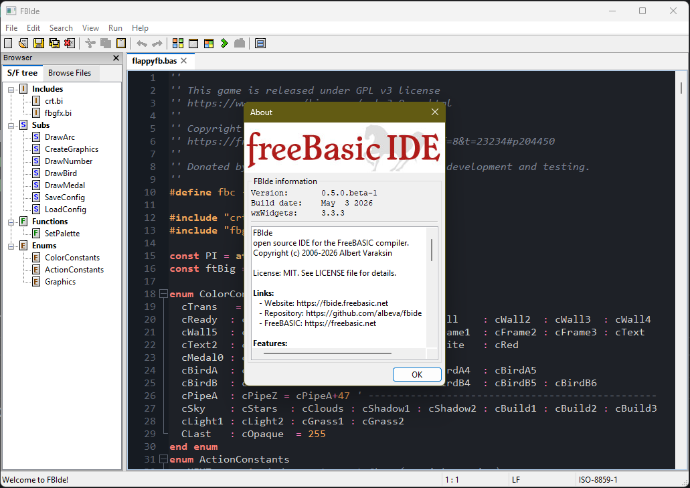

# FBIde

[](https://github.com/albeva/fbide/actions/workflows/ci.yml)

An open-source IDE for the [FreeBASIC](https://freebasic.net).
Lightweight, native, cross-platform — built on wxWidgets. This is a clean-room rewrite of the original FBIde
(0.4.5) in modern C++23, replicating the feature set with a maintainable
codebase.



## Features

- Native FreeBASIC source editor with syntax highlighting, code folding,
  and auto-indent.
- One-key compile, run, and quick-run with parsed compiler errors.
- Themable editor.
- Sub / Function browser, code formatter with case conversion, find /
  replace, recent-files history, multi-document tabs.
- Localised UI (English plus a dozen translations)
- Per-file context-sensitive help (CHM on Windows, online wiki fallback).

## Requirements

- C++23 compiler — MSVC 19.40+ on Windows, recent GCC or Clang on Linux.
- [CMake](https://cmake.org) 4.0 or newer.
- [Ninja](https://ninja-build.org) (recommended) or any CMake-supported
  generator.
- [wxWidgets](https://wxwidgets.org) 3.3.2 or newer, built statically.

## Build

Configure and build a Release tree:

```bash
cmake -G Ninja -DCMAKE_BUILD_TYPE=Release \
      -DWXWIN=/path/to/wxwidgets/dist \
      -B build/release -S .
cmake --build build/release
```

Debug build:

```bash
cmake -G Ninja -DCMAKE_BUILD_TYPE=Debug \
      -DWXWIN=/path/to/wxwidgets/dist \
      -B build/debug -S .
cmake --build build/debug
```

`WXWIN` points at the install prefix produced by `cmake --install` on a
wxWidgets build — the directory containing `lib/`, `include/`, …. Both
Debug and Release variants of wxWidgets must be installed into the same
prefix if you intend to switch FBIde build types against the same wx
tree.

The `fbide` executable lands in `bin/fbide.exe` (Windows) or `bin/fbide`
(Linux). Tests build to `build/<type>/tests/tests.exe` and can be run
via `ctest` from the build tree.

## License

- **Code** — MIT; see [LICENSE](LICENSE).
- **Artwork & branding** (app icon, document icons, splash, installer imagery,
  logo) — Creative Commons
  [CC BY-NC-ND 4.0](https://creativecommons.org/licenses/by-nc-nd/4.0/): free to
  use as part of FBIde, but not for sale, modification, or reuse in other
  projects without permission. See [ASSETS-LICENSE.md](ASSETS-LICENSE.md).
- **Third-party** — Dev-C++ icons (GPL v2) and the Arimo font (OFL 1.1); see
  [THIRD_PARTY_LICENSES.txt](resources/ide/THIRD_PARTY_LICENSES.txt).
